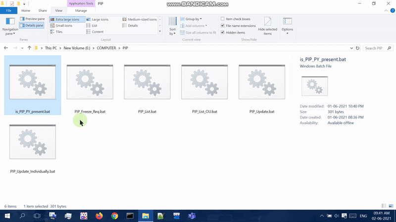
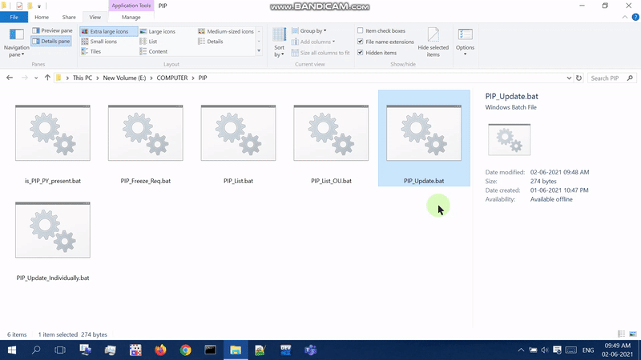
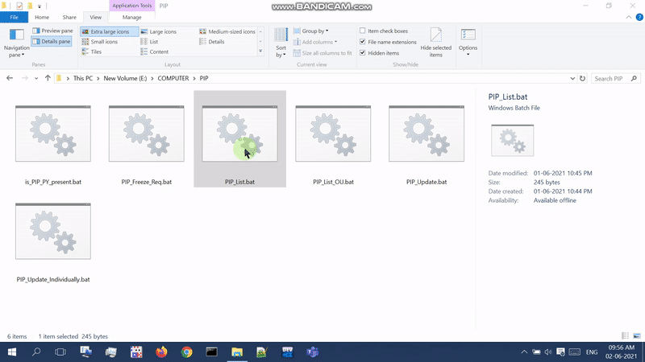
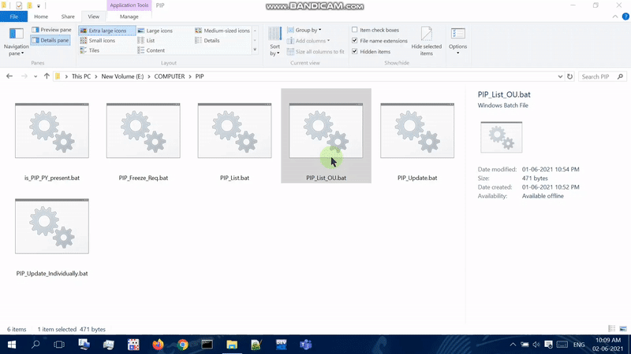
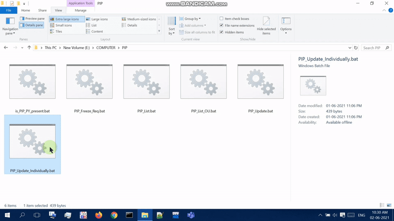
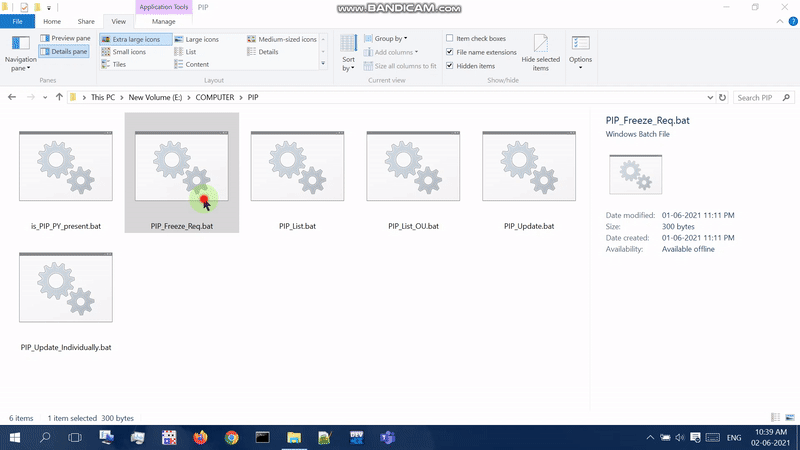

# Package Installer for Python
## Different Batch Programs to make PIP easier to work with

## Output
* ### is_PIP_PY_present.bat 
  ### Used to check if pip and python were installed or not
  
  

* ### PIP_Update.bat 
  ### Used to update pip
  
  

* ### PIP_List.bat 
  ### Used to show all packages that are installed in list format
  
  

* ### PIP_List_OU.bat 
  ### Used to show the <em>Outdated</em> and <em>Uptodate</em> packages
  
  

* ### PIP_Update_Individually.bat 
  ### Used to show the <em>Outdated</em> packages and update them individually
  
  

* ### PIP_Freeze_Req.bat 
  ### Used to create a <em>requirements.txt</em> file of all installed packages
  
---
## Usefull Links

* <a href="https://stackoverflow.com/questions/30813972/what-does-nul-21-mean-in-a-batch-statment">About &gt; nul 2&gt;&1</a>  
* <a href="https://stackoverflow.com/questions/8823643/echo-off-but-messages-are-displayed#:~:text=As%20Mike%20Nakis%20said%2C%20echo%20off%20only%20prevents%20the%20printing%20of%20commands%2C%20not%20results.%20To%20hide%20the%20result%20of%20a%20command%20add%20%3Enul%20to%20the%20end%20of%20the%20line%2C%20and%20to%20hide%20errors%20add%202%3Enul.%20For%20example%3A">More about &gt; nul 2&gt;&1</a>   
* <a href="https://stackoverflow.com/questions/818255/in-the-shell-what-does-21-a">Much more about &gt; nul 2&gt;&1</a>  
* <a href="https://www.robvanderwoude.com/errorlevel.php">Errorlevels in Batch</a>  
* <a href="https://superuser.com/questions/161125/how-do-i-enable-scrolling-in-windows-command-prompt#:~:text=Right-click%20on,to%20about%201000">Adding ScrollBar to Batch Window</a> 
